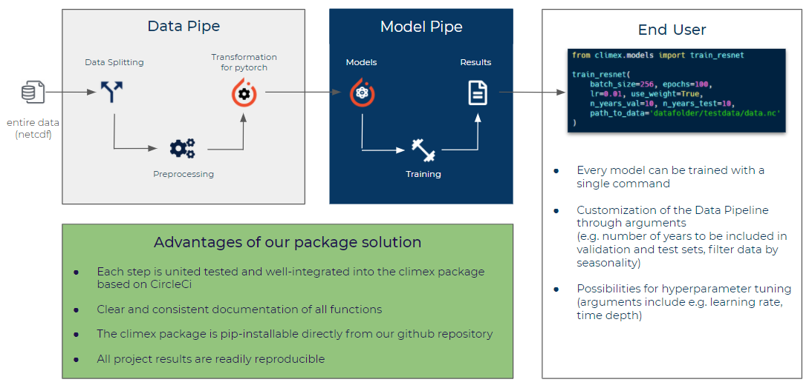

# Climex

[](https://github.com/KaihuaTang/Scene-Graph-Benchmark.pytorch/blob/master/LICENSE)
[](https://www.python.org/)


Created as part of an university project "Innovationlab Big Data Science" at LMU Munich in cooperation with the [ClimEx](https://www.climex-project.org/) at the Department for Geography. The work was supervised by Florian Pfisterer, Maximilian Weigert and Magdalena Mittermeier. 

For citation use: 
>Funk, H., Becker, C., Hofheinz, A., Xi, G., Zhang, Y., Pfisterer, F., Weigert, M., & Mittermeier, M. (forthcoming). Towards an automated classification of Hess & Brezowsky's atmospheric circulation patterns Tief and Trog Mitteleuropa using Deep Learning Methods. In Environmental Informatics: A bogeyman or saviour to achieve the UN Sustainable Development Goals?. Shaker.


## Project

### Topic of the Project: Atmospheric Circulation Patterns

The weather in Europe is mainly driven by high and low pressure systems and their
constellations to each other. Typical constellations of high and low pressure systems are
classified as atmospheric circulation patterns.
The class “Tief Mitteleuropa” is known to occur rarely (~ 10 days/year), but when it does it
often triggers extreme rainfall and floods in Central Europe. The more frequent class “Trog
Mitteleuropa” with about 20 days/year is also related to heavy rainfall (Ustrnul & Danuta,
2001).


### Objective of the Project: Classification of the circulation patterns with neural networks

The goal of this InnoLab-Project is to train a deep neural network on the detection of the two
atmospheric circulation patterns “Tief Mitteleuropa” (see exemplary figure 1) and “Trog
Mitteleuropa”. The training dataset consists of historic records of two air pressure levels over
Europe and corresponding labels with the circulation class. The historic record covers the
period from 1900 to 2010 in 3-hourly resolution.

The overall objective of the final, trained network is its applicability to climate models in order
to study how climate change affects the behavior of the two atmospheric circulation
patterns and their influence on extreme rainfall events and floods (not part of this project).


## Climex package

The climex package was set up with the aim to provide our project partners with clear and easy-to-use functions for reproducing and extending the most successfull models that we have created within the Innolab project. The available models in the package are:
- ResNet (function: `train_resnet`)
- CBAMResNet (ResNet with attention; function: `train_cbam_resnet`)
- ConvLSTM (function: `train_conv_lstm`)
- ViT (function: `train_vit`)


Once a train function for a specific model is executed, the raw data are automatically passed through the entire data and model pipeline without requiring any further manual effort. 

It is further possible to customize the data pipeline through several arguments such as the number of years that should be included in the validation and test sets. More details on the arguments can be found in the documentation of the specific function.



### How to use the Climex package

As long as it is a private repository, one needs to create a github `token` to install the climex package. This can be done quickly as described in the following link:

https://docs.github.com/en/github/authenticating-to-github/creating-a-personal-access-token

```bash
pip install git+https://${token}@github.com/henrifnk/climex.git
```


## How to train a model

In this example, we would like to give a showcase on how to train a ResNet model based on a random data split (years are randomly assigned to train, validaton and test sets with no overlap) with 8 years in the validation and 10 years in the test set. We further want to use the (automatically) weighted loss function.

First we have to import the climex package.

```python
from climex.models import train_resnet
```

We then have to specify the path of the raw data and the directory in which the trained model and the log file should be saved.

```python
path_to_raw_data = "datafolder/data.nc"
dir_result = "results/"
```

Then we can call the `train_resnet` function with the desired arguments and the raw data are automatically processed in the pipeline as described above and the model training is started.

```python
train_resnet(
    batch_size=256, epochs=100, 
    lr=0.01, use_weight=True,
    n_years_val=8, n_years_test=10,
    path_to_data=path_to_raw_data,
    model_dir=dir_result
)
```

